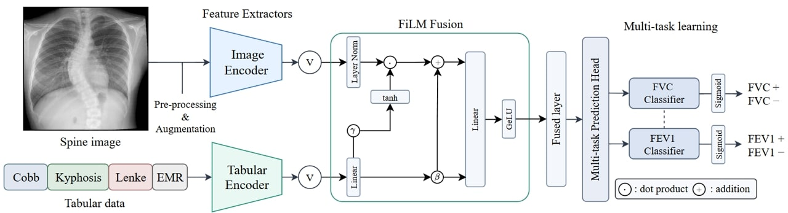
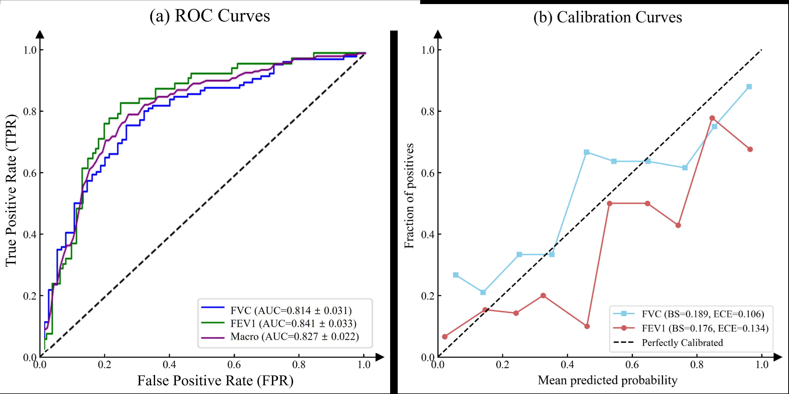
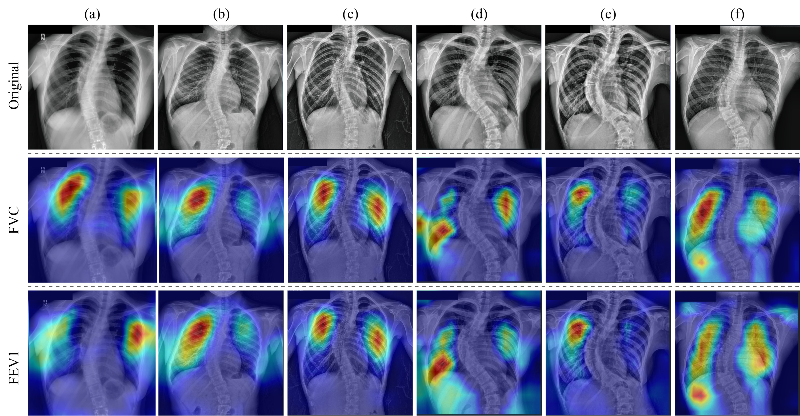

# SMC-scoliosis-pft

Multimodal deep learning that predicts **pulmonary dysfunction in adolescent idiopathic scoliosis (AIS)** from a standing posteroanterior radiograph combined with structured clinical variables.

This repository contains the research code for:

> **Spinal morphology–based multimodal AI for predicting pulmonary dysfunction in adolescent idiopathic scoliosis**
> Kim Y†, Park S-J†, Park J-S, Seo Y-G, Choi S, Chung MJ, Yoo H\*, Kang D-H\*
> *European Spine Journal* (2026). [10.1007/s00586-026-09893-2](https://doi.org/10.1007/s00586-026-09893-2)

---

## Overview

The Cobb angle has anchored the assessment of spinal deformity for decades, but it predicts pulmonary function poorly: 2D radiographic parameters explain under 20% of the variance in pulmonary function tests, and even 3D thoracic kyphosis explains under 10%. The limitation is not dimensionality — it is that reducing a deformed thorax to a handful of scalar measurements discards most of the morphology that determines how much the lungs can expand.

This model reads the radiograph whole. A dual-stream network extracts latent morphological features from the entire thoracic cage while a parallel encoder summarizes the clinical variables, and the two are fused so that the clinical context **modulates** the image features rather than merely sitting alongside them.

**Inputs** — one standing PA radiograph, plus age, sex, Cobb angle, thoracic kyphosis and Lenke classification.
**Outputs** — two binary predictions, jointly: FVC < 80% of predicted, and FEV1 < 80% of predicted.

### Architecture



The image encoder and tabular encoder process their respective inputs independently; the extracted features are integrated through FiLM fusion and passed to a multi-task head predicting FVC and FEV1 abnormality.

The **image branch** is an EfficientNet-B0 over the full 512 × 512 radiograph. The **tabular branch** is an MLP over the encoded clinical variables. The two are combined by **FiLM** (Feature-wise Linear Modulation): the clinical features generate a scale (γ) and shift (β) that are applied to the image features,

```
fused = LayerNorm(img_feat) · (1 + tanh(γ)) + β,    (γ, β) = W · tab_feat
```

so a clinical signal can amplify or suppress specific visual channels. A shared trunk then feeds two task-specific heads, trained jointly — multi-task learning lets the closely related FVC and FEV1 objectives share representation.

Why this matters in the results: concatenation *degraded* performance relative to the image-only baseline on the stronger backbones (macro-AUC 0.796 vs 0.809 for EfficientNet-B0), because 15 tabular features appended to a rich visual embedding are simply drowned out. FiLM was the only fusion strategy that improved on image-only across every backbone scale tested. **The method of fusion mattered as much as the addition of the second modality.**

## Results

Five-fold multilabel-stratified cross-validation over 178 patients, mean ± SD across folds.

| Task | Accuracy | AUC |
|---|---|---|
| FVC | 0.747 ± 0.033 | **0.814 ± 0.031** |
| FEV1 | 0.786 ± 0.053 | **0.841 ± 0.033** |

Macro-averaged over the two tasks: accuracy 0.767 ± 0.039, sensitivity 0.811 ± 0.049, specificity 0.724 ± 0.086, **AUC 0.827 ± 0.022**.

Against the best tabular-only baseline (logistic regression over engineered clinical features), AUC rises from 0.719 → 0.814 for FVC and 0.710 → 0.841 for FEV1. Predictions are well calibrated: Brier 0.189 (FVC) and 0.176 (FEV1), expected calibration error 0.106 and 0.134.



(a) ROC curves for FVC, FEV1 and the macro-average. (b) Calibration curves against the diagonal of perfect calibration, with Brier scores (BS) and expected calibration errors (ECE).

### Ablation — backbone × fusion (macro-AUC)

| Image encoder | Image-only | Concatenate | Attention | FiLM |
|---|---|---|---|---|
| **EfficientNet-B0** | 0.809 | 0.796 | 0.759 | **0.827** |
| ConvNeXt-Base | 0.813 | 0.802 | 0.790 | 0.817 |
| VGG-19 | 0.769 | 0.806 | 0.782 | 0.770 |
| DenseNet-121 | 0.739 | 0.726 | 0.715 | 0.777 |
| ResNet-50 | 0.689 | 0.704 | 0.658 | 0.749 |

The optimal fusion strategy is backbone-dependent, but FiLM never fell below the image-only baseline.

### Where it fails

57 of 178 patients were misclassified on at least one task; 15 (8.5%) on both. Two failure modes are systematic and clinically interpretable:

- **Extreme thoracic hypokyphosis** (T4–12 ≤ 6°) produced simultaneous false positives on both tasks. The model reads a flattened thorax as volume restriction even where physiology is preserved.
- **Visual–clinical discordance at extreme deformity.** One patient with a 106° Cobb angle was confidently called normal on both tasks (p < 0.1), the visual features overriding clinical severity — a consequence of 2D projection not capturing axial rotation and the resulting loss of internal thoracic volume.



Grad-CAM for six representative patients (a–f): the preprocessed radiograph (top) and the overlays for the FVC (middle) and FEV1 (bottom) heads. Activations concentrate on rib crowding near the apex, narrowed lung fields, and peri-diaphragmatic regions reflecting restricted mobility — pathophysiologically relevant areas, rather than gross spinal deviation. The blacked-out corners are where burned-in scanner annotations were removed during preprocessing.

## Dataset

Retrospective analysis of a prospectively collected single-institution cohort: **178 consecutive AIS patients**, aged 10–18, with both a standing PA radiograph and complete pulmonary function testing from their preoperative evaluation. Patients with non-idiopathic scoliosis, prior spinal surgery, or conditions independently confounding PFT were excluded. The IRB approved the protocol and waived individual consent given the retrospective, de-identified design.

Outcomes are binary, thresholded at 80% of predicted value using the GLI-2012 reference equations adjusted for age, sex, height and ethnicity (northeast Asian).

| Outcome | Normal (≥ 80%) | Abnormal (< 80%) |
|---|---|---|
| FVC | 104 | 74 |
| FEV1 | 60 | 118 |

> **Imaging data and trained model weights are not included in this repository.** The imaging and clinical data cannot be redistributed because of privacy and ethical restrictions on patient data collected at Samsung Medical Center, and trained checkpoints cannot be released under the institutional network security policy. This repository provides source code only; the reported metrics are those published in the paper and are not reproducible from this repository alone. See [Data and model availability](#data-and-model-availability).

Expected file layout and full column schemas are in [`docs/data.md`](docs/data.md).

## Preprocessing

Each radiograph is rescaled and windowed from the DICOM header (inverting `MONOCHROME1`), stripped of burned-in scanner text, histogram-matched to a fixed reference drawn **exclusively from the training set**, enhanced with CLAHE, and resized to 512 × 512 before ImageNet normalization.

Two choices are worth calling out:

**The thoracic cage is never cropped.** The region of interest is deliberately not narrowed to the spine, because rib crowding and lung-field geometry outside the vertebral column carry much of the signal relevant to pulmonary function.

**Burned-in text is removed, not ignored.** Scanner annotations sit in the same intensity range as bone, survive histogram matching and CLAHE, and offer the network a shortcut unrelated to anatomy. Detection is confined to the upper ROI where such text appears, uses a multi-scale top-hat with a percentile threshold, discards connected components too large to be text, and inpaints the mask — twice, since one pass leaves a grey halo.

Full parameters in [`docs/preprocessing.md`](docs/preprocessing.md).

## Repository layout

```
src/
├── multimodal/                  dual-stream model (image + tabular)
│   ├── dataset.py                 DICOM loading, preprocessing, tabular merge
│   ├── model.py                   backbones, tabular encoders, fusion modules
│   ├── train.py                   5-fold CV training + Grad-CAM  (published model)
│   ├── train_single_modal.py      image-only ablation
│   ├── evaluate.py                per-fold metrics from saved checkpoints
│   └── gradcam.py                 standalone Grad-CAM from checkpoints
└── common/
    └── preprocessing_demo.py      stage-by-stage preprocessing figure (Fig. S1)

configs/           reference hyperparameter configuration
docs/              data schema, preprocessing, and reproduction notes
figures/           de-identified figures from the paper
scripts/           end-to-end pipeline driver
```

`model.py` carries all the architectural variants behind the ablation: tabular encoders (`TabularMLP`, `TabularCNN1D`) and fusion modules (`GeneralAttentionFusion`, `SelfAttentionFusion`, `MultiHeadFusion`, `FiLMFusion`), selected by the `fusion_type` and `tabular_type` arguments to `MultiModalMTLModel`.

## Installation

Developed with Python 3.10, PyTorch 2.5.1 (CUDA 12.1) on NVIDIA RTX A6000 GPUs.

```bash
git clone https://github.com/ysKim2000/SMC-scoliosis-pft.git
cd SMC-scoliosis-pft
python -m venv .venv && source .venv/bin/activate
pip install -r requirements.txt
```

## Usage

Paths are set in the `if __name__ == '__main__'` block at the bottom of each script; there is no command-line interface. Place the data as described in [`docs/data.md`](docs/data.md) and set the histogram-matching reference before running.

```bash
# Published model — EfficientNet-B0 + MLP, FiLM fusion, 5-fold CV
python src/multimodal/train.py

# Metrics from saved checkpoints
python src/multimodal/evaluate.py

# Grad-CAM overlays
python src/multimodal/gradcam.py

# Image-only ablation (set USE_IMAGE_ONLY = True)
python src/multimodal/train_single_modal.py
```

Or run the whole sequence with [`scripts/run_pipeline.sh`](scripts/run_pipeline.sh). The ablation grid is widened by editing the `backbones`, `fusions` and `tabs` lists near the bottom of `train.py` — see [`docs/reproduction.md`](docs/reproduction.md).

The configuration matching the published model is in [`configs/training_config.yaml`](configs/training_config.yaml).

## Model selection and hyperparameters

AdamW at lr 1e-4, weight decay 1e-4, cosine annealing with warm restarts (T₀ = 10, T_mult = 2), batch size 16, up to 100 epochs with early stopping on validation loss (patience 10). The loss is `BCEWithLogitsLoss` with a per-task `pos_weight` computed from the training split — class imbalance is handled in the loss rather than by resampling, since resampling did not improve on the unresampled baseline. Augmentation combines affine jitter, random resized crop, horizontal flip and photometric jitter with batch-level MixUp/CutMix applied to image and tabular features together.

Architecture and hyperparameters were chosen **empirically** during development; no systematic or automated hyperparameter optimization was performed. A classification threshold of 0.5 was prespecified.

**Cross-validation, not a held-out test set.** All reported metrics are validation metrics aggregated across the five folds, and checkpoint selection happens on the fold being scored. This is optimistic relative to a held-out test set. Fold assignment is fixed (`random_state=42`), but training is not seeded, so per-fold numbers vary between runs by roughly the standard deviations in the table above. The `*_tuned` fields in the results JSON use a Youden's-J threshold fitted on the same fold and are correspondingly biased — they are not the headline numbers.

## Limitations

Single-center, retrospective, and modest in size. External validation was not feasible: no external cohort with paired full-spine radiographs and complete PFT data was available. The 80%-predicted threshold, while clinically intuitive for surgical risk stratification, dichotomizes a continuous measurement and loses information in the 75–85% borderline range, where 28% of this cohort sits. And the model remains a black box — Grad-CAM indicates where it looks, not why.

## Data and model availability

The datasets are not readily available because of strict privacy and ethical restrictions regarding patient clinical and imaging data collected at Samsung Medical Center. Requests to access the datasets should be directed to the corresponding author.

Trained model weights are likewise not distributed here: checkpoints were produced and stored inside the Samsung Medical Center internal network and cannot be released under the institutional security policy. All performance figures in this README are the values reported in the paper; re-running this code on other data will not reproduce them exactly.

## License

Source code is released under the [MIT License](LICENSE). The license covers the code only — it grants no rights to the clinical or imaging data, nor to any trained model weights.
